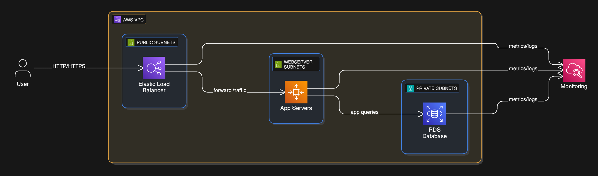
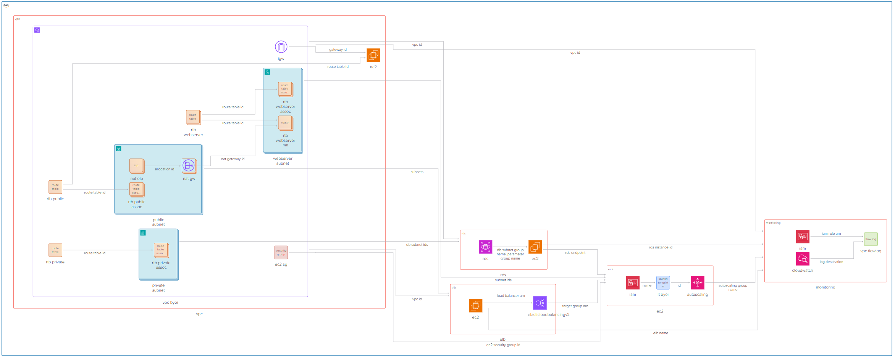

# WordPress Infrastructure Automation with Terraform - KBC BYOI
Terraform configuration for deployment of a scalable, highly available WordPress application on AWS.

## Architecture Diagram and Overview
### High-level Customer Request flow

### Low-level Component Diagram

#### The infrastructure consists of AWS components that include:

- VPC with subnets across multiple Availability Zones to achieve high availability.
- Public Subnets - Hosting the Application Load Balancer (ALB) and it's ENIs and NAT Gateways (with Elastic IPs) for managing external traffic.
- WebServer Subnets - Hosting the EC2 instances that are managed by the Auto Scaling Group.
- Private Subnets - Hosting the RDS instances.
- An Internet Gateway attached to the VPC.
- ELB - An Application Load Balancer to distribute incoming HTTP traffic between the EC2 instances.
- EC2 - EC2 instances for Wordpress under an Auto Scaling Group, configured to scale on demand.
- RDS - Highly available Multi-AZ managed MySQL database with Multi-AZ deployment for high availability.
- Security Groups - controlling inbound traffic and allowing outbound traffic to different resources to achieve secure access.
- CloudWatch - Log Groups and Alarms.

## Best Practices Used:

- Terraform Stack with configurable and reusable modules for IaC.
- VPC Security - Usage of Security Groups to restrict access for resources between subnets.
- Security - IAM role with certain policies for EC2 instances for secure credentials access and CloudWatch logging.
- High Availability - Multi AZ Deployment and configuration ready for deployment across other regions with little change to tfvars passed.
- Scalability - Configurable Auto Scaling Group for EC2 instances automatic scaling.
- Load Balancing - ELB that distributes requests between the EC2 instances.
- DRY approach to code and variables used.

## Ideas for Enhancement:

- HTTPS - TLS/SSL for the Application Load Balancer.
- Session Stickiness for the ALB.
- EC2 instance shared storage.
- Better usage of variables for setting of different environment stages (sev, val, prod, etc.)
- NACL usage to improve subnet-level security
- Improved monitoring:
    - Integration of monitoring for the Load Balancer with S3 and Lambda function.
    - Alarms triggering SNS topics.
- Containerization of application:
    - deployment with Fargate
    - scaling on Kubernetes

## Issues/Challenges faced during development

- Initially began deployment on an old personal account not used for a long time. Stumbled upon an issue where I was not able to launch EC2 instances and create Load Balancers in any region. AWS Support took more than 3 days to reach back to me and another 2 to clear the issue from my account.
- Error messages:

    - error: "This account is currently blocked and not recognized as a valid account"
    - ELBv2 error "This AWS account currently does not support creating load balancers"

- Created a secondary personal account, which to this day is not enabled to create Load Balancers, even though a support ticket by another customer stated that a little bill must be charged by AWS to overcome this.
